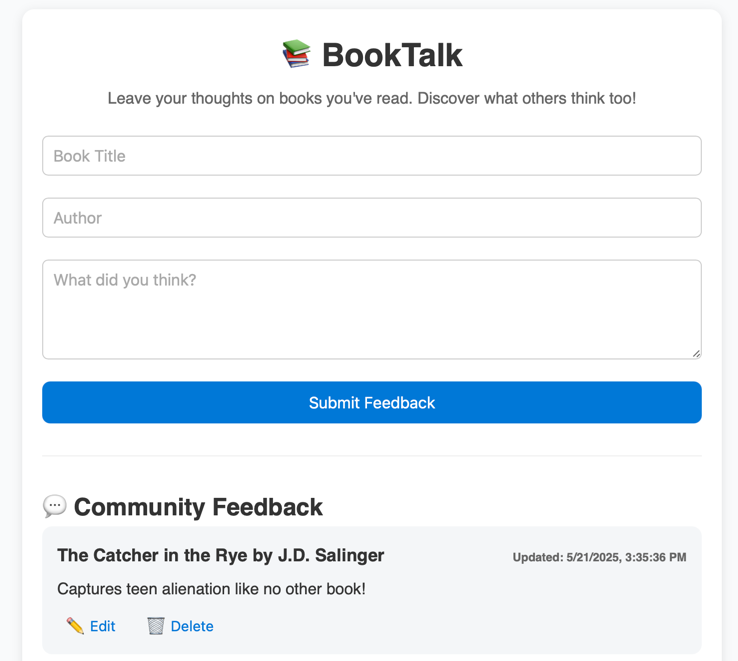

# BookTalk: Azure-Powered Feedback App

BookTalk is a simple feedback application where users can share their thoughts on books they've read. It features a static frontend hosted on Azure and a backend powered by Azure Functions and Azure Table Storage for full CRUD operations.

---

## Technologies Used

* **Frontend:** HTML, CSS, JavaScript
* **Backend:** Azure Functions (JavaScript)
* **Database:** Azure Table Storage
* **Hosting:** Azure Static Website (via Blob Storage)

---

## Project Structure

Frontend:

```
BookTalk/
├── booktalk-api
├── index.html
├── styles.css
└── script.js
```

Backend

```
booktalk-api/
├── addEntry/
│   ├── index.js
│   └── function.json
├── getEntries/
│   ├── index.js
│   └── function.json
├── updateEntry/
│   ├── index.js
│   └── function.json
├── deleteEntry/
│   ├── index.js
│   └── function.json
├── host.json
├── local.settings.json
├── package.json
```

## Azure Services Used

| Azure Service              | Purpose in Your Project                                         |
|----------------------------|-----------------------------------------------------------------|
| **1. Azure Functions**     | Handles backend logic (CRUD operations via HTTP triggers)       |
| **2. Azure Table Storage** | Stores all feedback data (title, author, comment, timestamps)   |
| **3. Azure Blob Storage**  | Hosts the static frontend as a **Static Website** (HTML/CSS/JS) |
| **+ Resource Group**       | Organizes all these services under one deployable unit          |



---

## Step-by-Step Setup

### 1. Create Azure Resources

```bash
az login
az group create --name booktalk-rg --location westeurope
az storage account create --name booktalkstorage --resource-group booktalk-rg --location westeurope --sku Standard_LRS
az functionapp create \
  --resource-group booktalk-rg \
  --consumption-plan-location westeurope \
  --runtime node \
  --functions-version 4 \
  --name booktalk-functions \
  --storage-account booktalkstorage
```

### 2. Initialize Azure Function App

```bash
func init booktalk-api --javascript
```

### 3. Create Function Files

```bash
cd booktalk-api
func new --name addEntry --template "HTTP trigger" --authlevel "anonymous"
func new --name getEntries --template "HTTP trigger" --authlevel "anonymous"
func new --name updateEntry --template "HTTP trigger" --authlevel "anonymous"
func new --name deleteEntry --template "HTTP trigger" --authlevel "anonymous"
```

### 4. Move Functions to Individual Folders (if not already)

Each function should have its own folder containing `index.js` and `function.json`.

**Important:** If you previously had all your functions in `src/functions/*.js`, you must:
- Move each function to its own folder
- Delete the line `"main": "src/functions/*.js"` from `package.json` (Azure doesn't support wildcard `main` entries)
- Ensure your `package.json` looks like this:

```json
{
  "name": "booktalk-api",
  "version": "1.0.0",
  "dependencies": {
    "@azure/data-tables": "^14.0.0",
    "uuid": "^9.0.0"
  }
}
```

### 5. Install Dependencies

```bash
npm install @azure/data-tables uuid
```

### 6. Add Azure Storage Connection String

```bash
az functionapp config appsettings set \
  --name booktalk-functions \
  --resource-group booktalk-rg \
  --settings AzureWebJobsStorage="<your-storage-connection-string>"
```

### 7. Error Handling

```bash
az functionapp log stream --name booktalk-functions --resource-group booktalk-rg
```

1. **Go to the Azure Portal**
    [Azure Portal](https://portal.azure.com)

2. In the left sidebar, go to **“Storage accounts”**

3. Click your storage account (e.g., `booktalkstorage`)

4. In the **left menu**, scroll down to **Security + networking** → click **“Access keys”**

5. You'll see two key sets (`key1`, `key2`), each with:

    * `Key`
    * `Connection string`

6. Click **“Show”** next to the connection string under `key1`

7. Click the **copy icon** to copy it

### 7. Deploy Functions

```bash
func azure functionapp publish booktalk-functions
```

---

## Deploy Frontend to Azure Blob Static Website

### 1. Enable Static Website in Azure Portal

* Go to your Storage Account → Static website → Enable
* Set index document to `index.html`

### 2. Upload Frontend Files

Upload `index.html`, `styles.css`, and `script.js` to the `$web` container.

### 3. CORS Setup for Azure Functions

To allow your frontend (static website) to call the Azure Functions API, you must configure CORS:

1. Go to your **Function App** in the Azure Portal
2. Navigate to **API > CORS** in the left menu
3. Add your frontend static website URL (e.g. [BookTalk](https://booktalkstorage.z6.web.core.windows.net))
4. Enable Access-Control-Allow-Credentials by checking the box
5. Click **Save**

This ensures your browser won't block requests due to cross-origin policy errors.

---

## Live API Endpoints

| Function | Method | URL                                                                         |
|----------|--------|-----------------------------------------------------------------------------|
| Get All  | GET    | [GetEntries](https://booktalk-functions.azurewebsites.net/api/getentries)   |
| Add New  | POST   | [AddEntry](https://booktalk-functions.azurewebsites.net/api/addentry)       |
| Update   | PUT    | [UpdateEntry](https://booktalk-functions.azurewebsites.net/api/updateentry) |
| Delete   | DELETE | [DeleteEntry](https://booktalk-functions.azurewebsites.net/api/deleteentry) |

---

## Features Implemented

* Add book feedback (title, author, comment)
* Display feedback with pagination (5 per page)
* Edit & delete feedback entries
* Responsive layout
* Textarea resizing fixed (only vertical)
* CORS enabled for frontend-backend connection

---

## Final Notes

* All entries are stored in Azure Table Storage under the table `BookFeedback`.
* Frontend and backend are fully decoupled and hosted separately in Azure.
* Pagination and styling are fully responsive for modern browsers.