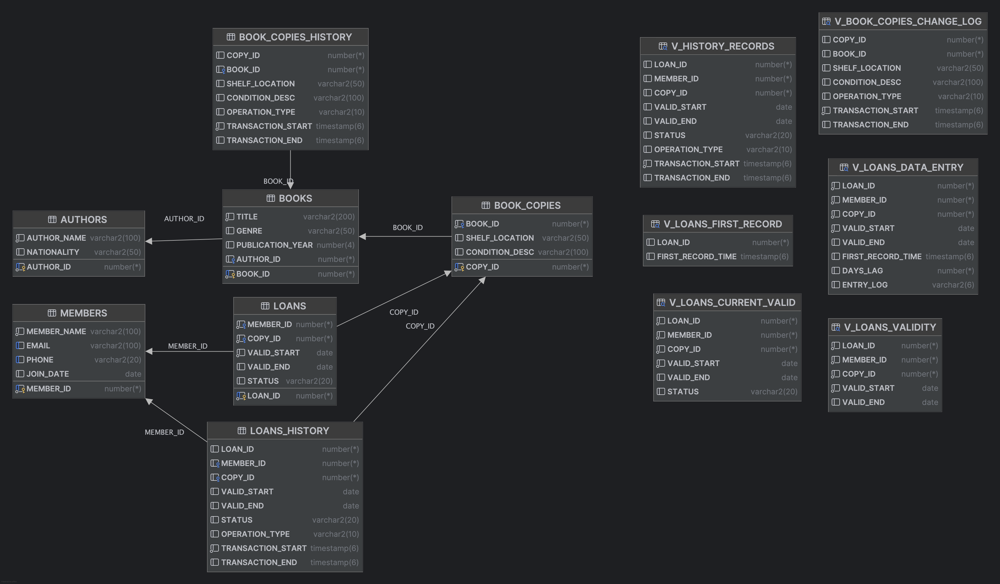

# Bitemporal Library DB

This project models a library where two clocks matter at the same time: when something is true **in the real world** (valid time) and when the database **knew** about it (transaction time). Books can be borrowed and returned on real dates, but staff might enter or correct those details later. The schema captures both realities so we can answer questions like “Who had the book on Oct 27?” and also “What did the system believe on Oct 27?”

## Schema Overview

* `AUTHORS`, `BOOKS`, `MEMBERS`: basic reference data.
* `BOOK_COPIES`: tracks physical copies of books, with history in `BOOK_COPIES_HISTORY`.
* `LOANS`: records borrowings with valid time (`VALID_START`, `VALID_END`) and history in `LOANS_HISTORY`.
* Views like `V_LOANS_CURRENT_VALID`, `V_BOOK_COPIES_CHANGE_LOG`, `V_LOANS_FIRST_RECORD`, `V_LOANS_DATA_ENTRY`, and `V_LOANS_VALIDITY` answer the assignment’s questions.
* Triggers on `BOOK_COPIES` and `LOANS` maintain transaction time intervals in their respective history tables.
* A Python seeder populates the database with sample data.



## Approach

I split responsibilities cleanly:

* **Valid time** lives in the `LOANS` table using Oracle’s `PERIOD FOR VALID_TIME (VALID_START, VALID_END)`. Those dates describe the *real* borrowing interval. Constraints keep it sane (`VALID_END` null or ≥ start). This lets Oracle power “as-of valid time” queries directly on the base table.

This is defined **directly on the base table**, not in a view. Oracle requires the `PERIOD FOR` clause to be attached to an actual stored table because the database internally indexes the period metadata and ensures correct temporal comparisons. A view does not store data, so Oracle cannot attach temporal consistency rules to it. By defining the period on the `LOANS` table, we enable native queries such as:

```sql
SELECT * FROM LOANS
AS OF PERIOD FOR VALID_TIME DATE '2025-10-15';
```
which tells us what loans were valid on a particular real-world date.

* **Transaction time** is tracked in parallel **history tables**:

  * `BOOK_COPIES_HISTORY` and `LOANS_HISTORY` each carry `TRANSACTION_START` and `TRANSACTION_END`. These columns tell us when a version was in effect inside the database.
  * Row-level triggers on `BOOK_COPIES` and `LOANS` maintain those intervals automatically. On insert, a new open version starts now. On update, the current open version is closed and a new one opens. On delete, the open version is closed (and I also record a terminal “DELETE” snapshot for auditability).

This yields a classic **bitemporal** design: the `LOANS` table speaks for reality; the `*_HISTORY` tables speak for the system’s evolving knowledge. With that, the views cover the assignment’s questions:

* current valid loans (`V_LOANS_CURRENT_VALID`);
* copy change log with before/after via window functions (`V_BOOK_COPIES_CHANGE_LOG`);
* late/early data entry by comparing first transaction to valid start (`V_LOANS_FIRST_RECORD`, `V_LOANS_DATA_ENTRY`);
* validity overlap checks for arbitrary periods (`V_LOANS_VALIDITY`);
* transaction-time snapshots (“what the system knew at T”) over `LOANS_HISTORY` using timestamp containment.

A small Python seeder populates authors, books, members, copies, and a mix of active/returned loans with realistic dates; triggers then produce transaction history automatically.

## Challenges and how I handled them

**Getting the two timelines straight.** It’s easy to mix “happened” with “was recorded.” The fix was to be strict: *only* `LOANS` owns valid time; *only* history tables own transaction time. Queries then decide which timeline to read.

**Interval logic and off-by-one edges.** This ensures the result reflects exactly what the system believed at that time.

A practical difficulty arose with **Oracle's timestamp literal handling**. Oracle does *not* accept raw date-time strings such as:

```
2025-10-27 00:00:00
```

Trying to use that format results in syntax errors like `ORA-00907`. The correct usage is either:

```sql
TIMESTAMP '2025-10-27 00:00:00'
```

or:

```sql
TO_TIMESTAMP('2025-10-27 00:00:00', 'YYYY-MM-DD HH24:MI:SS')
```

This impacted the transaction-time snapshot queries and required careful rewriting to avoid implicit conversion issues.

**Audit semantics on DELETE.** Some designs only close the open version. I kept a terminal record with `OPERATION_TYPE='DELETE'` and `TRANSACTION_START=TRANSACTION_END=SYSTIMESTAMP` to make deletions visible in reports, while still closing the prior open version. That keeps both compliance and interval math happy.

**Mixing DATE and TIMESTAMP.** `VALID_*` are `DATE` (sufficient day+time in Oracle DATE), while transaction columns are `TIMESTAMP`. When comparing across them, I cast deliberately or use TIMESTAMP literals to avoid implicit conversions.

**PERIOD FOR syntax nuances.** Oracle’s `PERIOD FOR` is powerful but has quirks. I ensured constraints and queries respected its semantics, especially around open-ended intervals (the null end means “still valid”).

## What I learned about temporal databases

Bitemporal modeling is less about fancy SQL and more about **discipline**. The moment you separate “true in the world” from “known by the system,” awkward questions become answerable: was an entry late, what did we believe last week, how did that belief evolve? Triggers are a pragmatic way to bring transaction time to systems that don’t have native system-versioned tables; Oracle’s `PERIOD FOR` does the heavy lifting for valid time. Intervals force you to think in **containment**, not equality. And once the patterns are in place—period overlap for valid time, point-in-interval for transaction time—the rest of the reporting becomes surprisingly elegant.