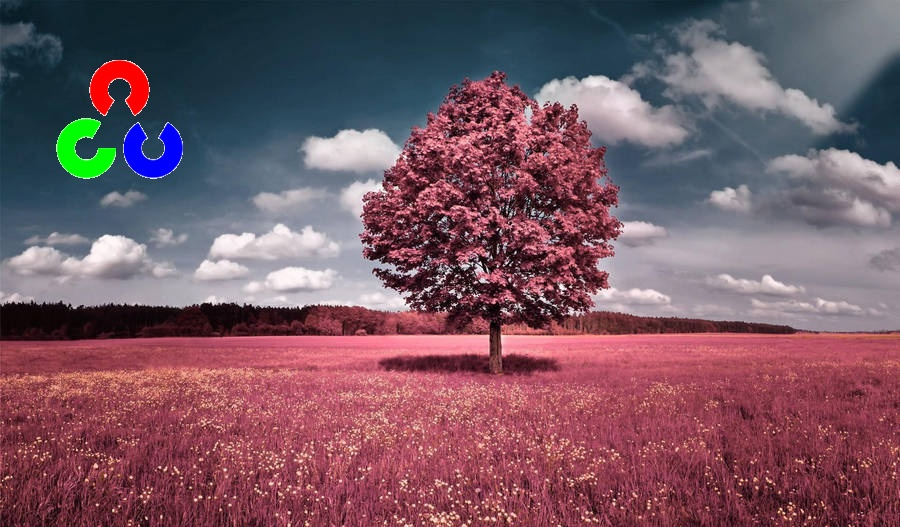

Here is the **updated README**, rewritten cleanly and with explicit mention that the **CSV/JPG logo is automatically turned into a PNG-style
transparent logo** (white background removed) using threshold masking.

You can paste this directly into your project.

# Logo Overlay Processing Script

This project overlays a logo onto:

* A **single input image** (`image.jpg`)
* A **video file** (`video.mp4`)

Before overlaying, the script **automatically transforms the original logo image (JPG/PNG/CSV-exported logo) into a transparent PNG-like
version** by:

* Detecting its **white/light background**
* Removing it using **grayscale thresholding**
* Creating an **alpha-style mask**

This ensures the logo blends cleanly on top of images and videos even if it originally had a white box around it.

## Installation

Install OpenCV:

```bash
pip install opencv-python
```

## Folder Structure

Place your files like this:

```
project/
│── main.py
│── input/
│   ├── image.jpg
│   ├── opencv_logo.jpg
│   └── video.mp4
└── output/
    ├── image_with_logo.jpg
    └── video_with_logo.mp4
```

Run the script:

```bash
python3 main.py
```

## Input Files

| File name         | Description                                                                    |
|-------------------|--------------------------------------------------------------------------------|
| `image.jpg`       | Scene image where the logo will be placed                                      |
| `video.mp4`       | Input video to apply the overlay to                                            |
| `opencv_logo.jpg` | Logo **with white background**, which will be converted to “PNG” (transparent) |

## Output Files

| Output file           | Result                                         |
|-----------------------|------------------------------------------------|
| `image_with_logo.jpg` | Scene with transparency-cleaned logo overlaid  |
| `video_with_logo.mp4` | Video with transparency-cleaned logo per frame |

## How Background Removal Works (Logo → Transparent)

The logo does **not** need to be a PNG.

It can be:

* JPG
* JPEG
* PNG without alpha
* Even an exported image from CSV data

The script converts it into a PNG-style transparent overlay automatically:

1. Convert the logo to **grayscale**
2. Apply a **threshold** (default `THRESH = 245`)
3. Create:

    * A **mask** marking logo pixels (opaque)
    * An **inverse mask** marking background pixels (transparent)
4. Composite the logo onto the image or frame:

    * Transparent areas show the original background
    * Colored/dark areas show the logo

This effectively **removes the white background**, even from low-quality or compressed logos.

## Key Parameters

| Variable     | Meaning                                   | Default    |
|--------------|-------------------------------------------|------------|
| `TOP_LEFT`   | Position of logo in output image `(x, y)` | `(20, 20)` |
| `LOGO_WIDTH` | Scaled output width of logo               | `200 px`   |
| `THRESH`     | Sensitivity for white-background removal  | `245`      |

Tips:

* Increase `THRESH` if white edges remain around the logo.
* Decrease `THRESH` if transparent areas start removing real logo content.

## Visual Example

| Input Scene          | Scene With Logo                 |
|----------------------|---------------------------------|
|  |  |