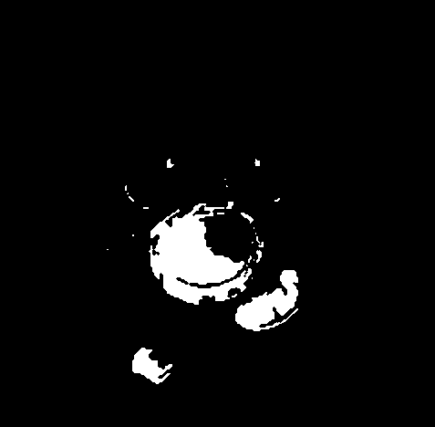
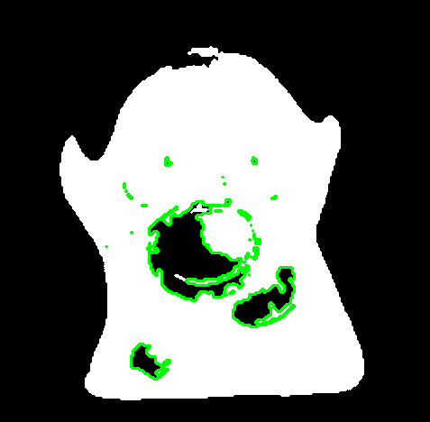
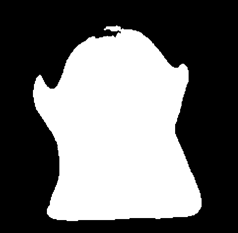

# **Morphological Hole Filling and Hole Extraction Using Reconstruction**

This pipeline takes a **binary object mask** (e.g., segmentation of a mammogram breast region or any binary foreground object) and:

1. **Detects internal holes** inside the object
2. **Fills those holes** using *morphological reconstruction* (not flood-fill)
3. **Separates the holes** as an independent binary mask
4. **Produces a collage** summarizing the processing steps

## **Input Requirements**

* The input image may be **grayscale** or already **binary**.
* If the image is grayscale, the script automatically applies **Otsu thresholding**.
* If the input is already binary, no thresholding or CLAHE is performed.

## **Method Overview**

### 1. **Binary Mask Normalization**

If the input is not binary:

* Apply **Otsu thresholding** to obtain a clean binary foreground mask.

If it is already binary:

* Use the mask directly.

### 2. **Noise Cleaning (Optional)**

* A small **morphological opening** removes speckle noise if present.
* The **largest connected component** can be selected to isolate the main object.

### 3. **Hole Extraction (Morphological Reconstruction)**

We perform **morphological reconstruction on the complement**:

1. Compute the inverse of the binary mask.
2. Initialize a marker containing background pixels touching the image border.
3. Iteratively **dilate the marker** under the constraint of the inverse.
4. Regions of the inverse **not reachable from the border** are **holes**.

### 4. **Fill the Holes**

```text
filled_mask = original_mask ∪ holes
```

### 5. **Visualizations and Outputs**

* `filled.png` – mask with holes filled
* `holes_mask.png` – holes only (foreground removed)
* `holes_contours.png` – hole contours drawn on the binary object
* `collage.png` – combined visualization:
  *input → holes → holes+contours → filled*

## **Usage**

```bash
python3 main.py
```

Outputs are saved into the `output/` directory.

## **Example Output Structure**

```
output/
 ├─ binary_used.png
 ├─ collage.png
 ├─ filled.png
 ├─ holes_contours.png
 ├─ holes_mask.png
 └─ input.png
```

## **Collage Layout**

| Input                 | Holes Only                 | Holes with Contours            | Filled Mask            |
|-----------------------|----------------------------|--------------------------------|------------------------|
|  |  |  |  |