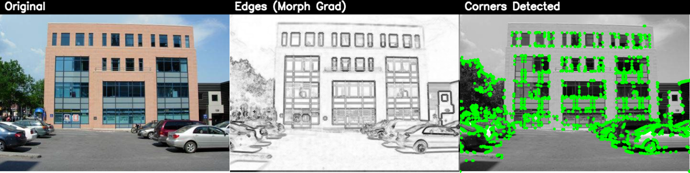
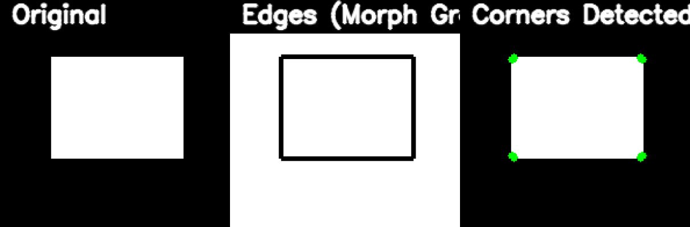
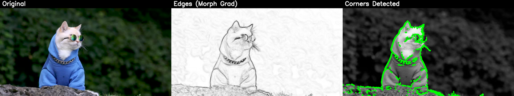

# Morphological Corner Extraction

This project detects **corners** in images using a simple sequence of **morphological operators** and saves a **single-row panel per image
**:

**Row layout:** `Original | Edge Detection | Corners Detection`

No global collage, no separate mask files.

## What it does

For every image in `./input`, the script:

1. Converts to grayscale.
2. Computes a morphological **gradient** (as “Edge Detection”).
3. Runs the corner-extraction pipeline:

    * `R1 = Dilate(gray, cross)`
    * `R1 = Erode(R1, diamond)`
    * `R2 = Dilate(gray, x_shape)`
    * `R2 = Erode(R2, square)`
    * `R = absdiff(R2, R1)`
    * `R_thresh = threshold(R, 35)`
4. Overlays detected corners (green dots) on the grayscale image.
5. Saves a **row image** to `output/<name>_row.png`.

> Note: In the provided code, `diamond` uses a rectangular structuring element `cv2.MORPH_RECT(7,7)` to match the exact snippet requirement.
> You can swap it for a true diamond kernel if needed.

## Folder Structure

```
.
├─ input/
│   ├─ image1.png
│   ├─ image2.png
│   └─ image3.png
├─ main.py
└─ output/
    ├─ image1_row.png
    ├─ image2_row.png
    └─ image3_row.png
```

## Requirements

* Python 3.8+
* Packages:

  ```bash
  pip install opencv-python numpy
  ```

## How to Run

1. Place your images in `./input`.
2. Run the script:

   ```bash
   python3 main.py
   ```
3. Find the generated rows in:

   ```
   output/<image-name>_row.png
   ```

## Algorithm Details

### Structuring Elements (as in code)

```python
cross = cv2.getStructuringElement(cv2.MORPH_CROSS, (5, 5))
diamond = cv2.getStructuringElement(cv2.MORPH_RECT, (7, 7))
x_shape = cv2.getStructuringElement(cv2.MORPH_CROSS, (5, 5))
square = cv2.getStructuringElement(cv2.MORPH_RECT, (5, 5))
```

### Pipeline

```text
R1 = Dilate(gray, cross)
R1 = Erode(R1, diamond)

R2 = Dilate(gray, x_shape)
R2 = Erode(R2, square)

R  = absdiff(R2, R1)
R_thresh = threshold(R, 35)  # adjustable
```

### Overlay

* Extract contours from `R_thresh`.
* Draw small green circles at each contour point on the grayscale image (converted to BGR).

## Configuration Tips

* **Threshold sensitivity**: In `extract_corners(..., threshold=35)`, increase the value to reduce noise, decrease it to detect more points.
* **Point size**: In `overlay_corners_on_image(..., point_size=2)`, adjust to make corner markers bigger/smaller.
* **Row height**: In `make_row(..., target_h=360)`, change the target height for larger/smaller panels.

## Tested Inputs

Works with `.png`, `.jpg`, `.jpeg`, `.bmp`, `.tif`, `.tiff` placed in `./input`.

## Example Output

| Input                 | Output                     |
|-----------------------|----------------------------|
|  |  |
|  |  |
|  |  |